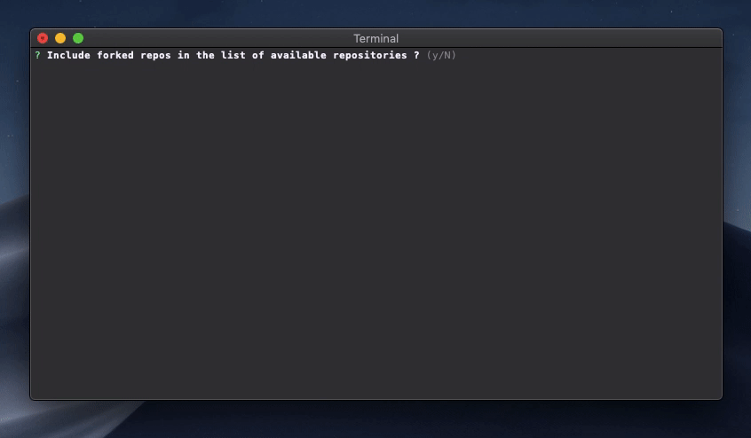

# Hubnow

Git clone cli to select and clone a remote repo using the GitHub GraphQL API.

Author : [Roberto Entringer](https://robertoentringer.com)  
License: MIT  
Repo on Github : https://github.com/robertoentringer/hubnow   
Npm package : https://www.npmjs.com/package/hubnow

# Installation

```shell
$ npm -g install hubnow
```
# Usage

```bash
$ hubnow
```
or 

```shell
$ npx hubnow
```

# Demo

[](https://github.com/robertoentringer/hubnow)